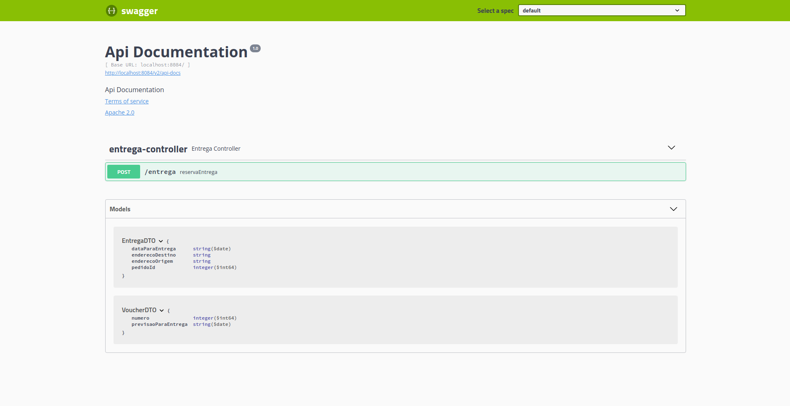

# transportador

Projeto desenvolvido no curso de Microservices com Spring Cloud

Projetos que fazem parte desse curso:

- loja

- zuul

- fornecedor

- auth

- config-server

- microservice-settings

- eureka-server

Documentação da API via Swagger

